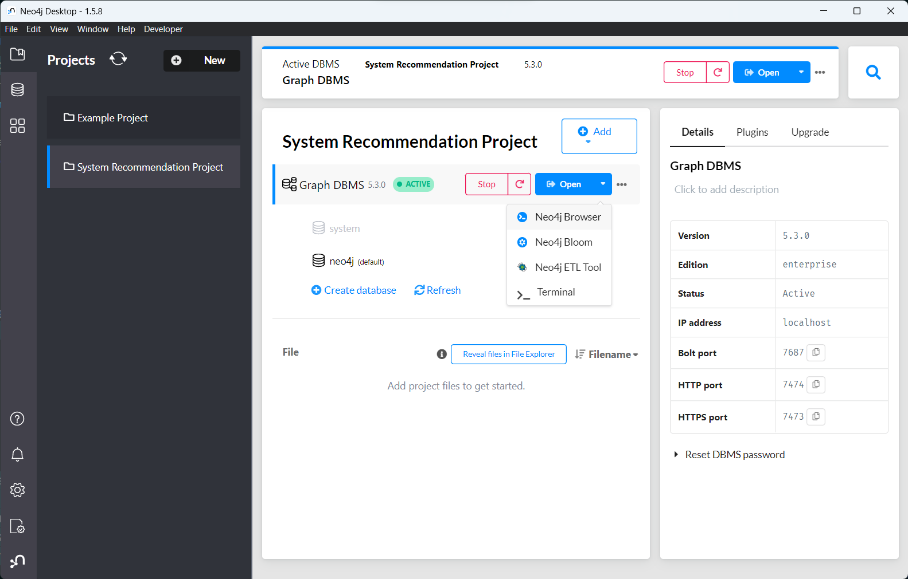

<h1 align="center">Job Recommendation System

<a href="https://www.producthunt.com/posts/awesome-github-profiles?utm_source=badge-featured&utm_medium=badge&utm_souce=badge-awesome-github-profiles" target="_blank"></h1>
<div align="center">

<a href="https://github.com/MohamedArbani"></a>


<a href="https://discord.gg/yugioh"></a>
<a href="https://twitter.com/MohamedArbani1" > </a>
<br>

<i>A curated list of awesome of my projects</i>

<a href="https://github.com/abhisheknaiidu/awesome-github-profile-readme/stargazers"></a>
<a href="https://github.com/abhisheknaiidu/awesome-github-profile-readme/network/members"></a>
<a href="https://github.com/abhisheknaiidu/awesome-github-profile-readme/pulls"></a>
<a href="https://github.com/abhisheknaiidu/awesome-github-profile-readme/issues"></a>
<a href="https://github.com/abhisheknaiidu/awesome-github-profile-readme/graphs/contributors"></a>
<a href="https://github.com/abhisheknaiidu/awesome-github-profile-readme/blob/master/LICENSE"></a>

<i>Loved the project? Please consider [donating](https://paypal.me/mohamedarbani01) to help it improve!</i>

</div>

## Team Workers 👨‍💻
- [ANEDDAME Mouna](https://github.com/Spec2uloos)
- [ARBANI Mohamed](https://github.com/MohamedArbani)
- [FARISS Younes](https://github.com/FarissYounes)
- [REAZZAKI Safae](https://github.com/REZZAKI-Safae)


## Job Recommendation - NEAN Stack - Full App

This project was generated with [Angular CLI](https://github.com/angular/angular-cli) version 16.0.2.

## Installation

## Database - Neo4J Desktop

### 1. Run Neo4J Desktop :


### 2. Open your graph database in Neo4J Browser


### 3. Create a user in Neo4J :
Username : `root`
Password : `root1234`
With `admin` and `PUBLIC` roles


#### NB⚠️
Please make sure that your Neo4J Database is running on :
```
neo4j://localhost:7687
```
If it's not, go to the `server/.env` file and change the `NEO4J_URI`
```
NEO4J_URI=[neo4j|bolt]://[host]:[port]
```
### Backend
Run this command :
```bash
cd server
npm i
npm start
```
If it's not working run : 
```bash
npm i --legacy-peer-deps
``` 
or 
```bash
npm i --force
```

### Frontend
Run this command :
```bash
cd frontend/user-management
npm i
ng serve --open
```
If it's not working run : 
```bash
npm i --legacy-peer-deps
``` 
or 
```bash
npm i --force
```

#### Development server

Run `ng serve` for a dev server. Navigate to `http://localhost:4200/`. The application will automatically reload if you change any of the source files.

#### Code scaffolding

Run `ng generate component component-name` to generate a new component. You can also use `ng generate directive|pipe|service|class|guard|interface|enum|module`.

#### Build

Run `ng build` to build the project. The build artifacts will be stored in the `dist/` directory.

#### Running unit tests

Run `ng test` to execute the unit tests via [Karma](https://karma-runner.github.io).

#### Running end-to-end tests

Run `ng e2e` to execute the end-to-end tests via a platform of your choice. To use this command, you need to first add a package that implements end-to-end testing capabilities.

#### Further help

To get more help on the Angular CLI use `ng help` or go check out the [Angular CLI Overview and Command Reference](https://angular.io/cli) page.

## License

[](https://creativecommons.org/publicdomain/zero/1.0/)

To the extent possible under law, [Mohamed Arbani](https://github.com/MohamedArbani) has waived all copyright and related or neighboring rights to this work.

